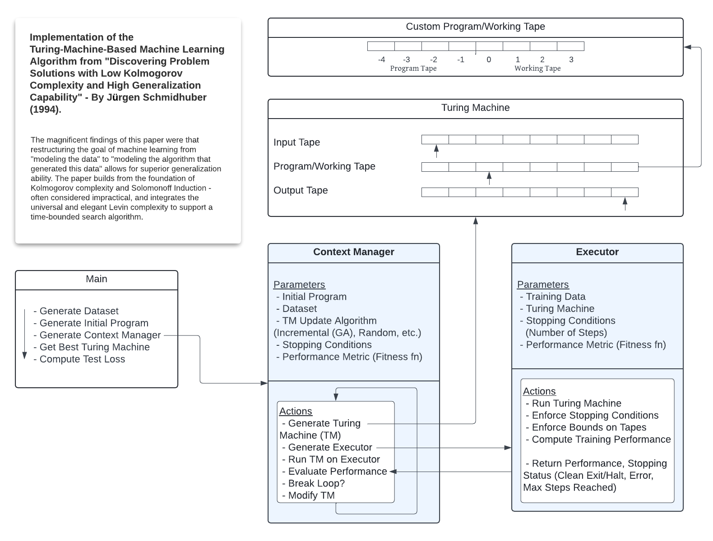
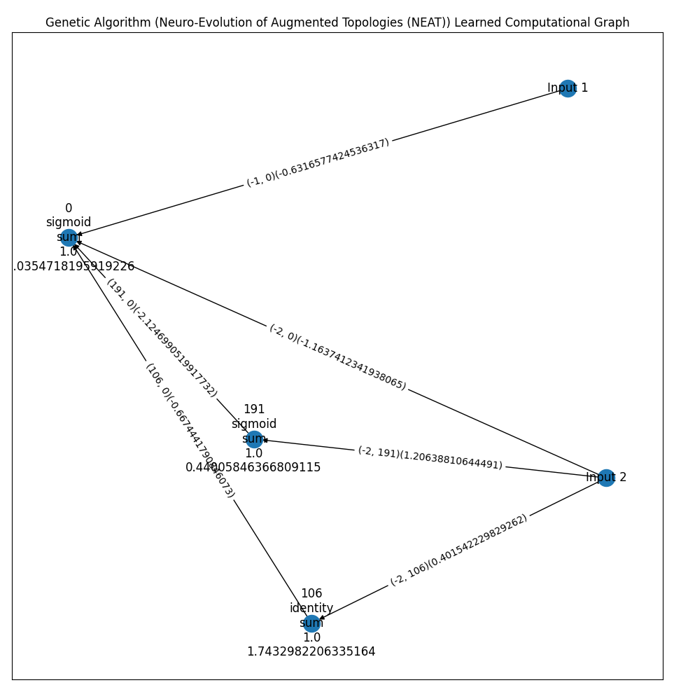
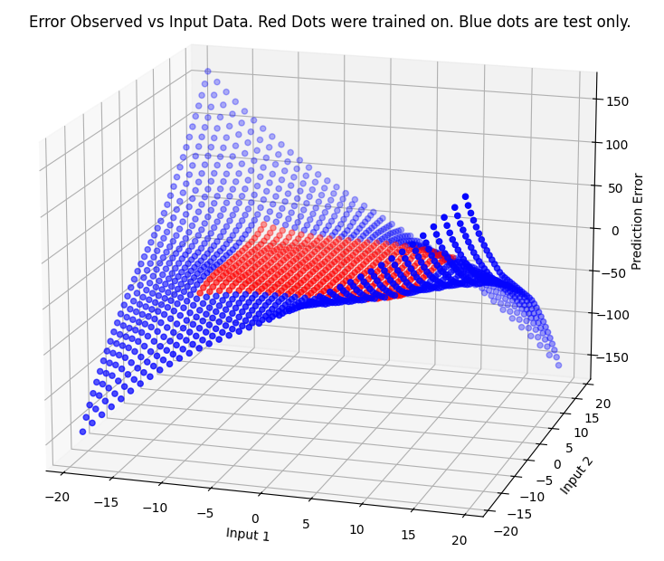

# Pursuit-of-AGI

This project aims to explore and push the current boundaries of Machine Learning (ML). It is and will further become both a directed results-driven effort, as well as a personal hobby. I also hope to establish a baseline and pointed research interest that will serve to benefit a future doctoral journey.

Implemented here is a bank of experiments, all regarding exploring the limits of current ML techniques, and neural generalization. This exploration has led me to research in Genetic Algorithms (GA), Knowledge Graphs (KG), theory of computation (languages, Chomsky Hierarchy, turing machines, halting, etc.), distributed/federated learning, neocortical theory, and much more.

# Highlights

My favorite and most interesting experiments include:
 - [A Turing-Machine based Machine Learning Algorithm which uses Levin Complexity and the principles of Solomonoff Induction to exhibit impressive generalization capabilities within a time-bound framework.](experiments/levin_tm/README.md)

# Gallary of Generated Gems

<style>
    .gallery {
        display: flex;
        flex-wrap: wrap;
        justify-content: center;
        gap: 10px;
        height: 300px;
    }
    .gallery img {
        width: auto;
        height: auto;
        border-radius: 5px;
    }
</style>

<div class="gallery">
    
    
    
</div>

## Installation

Generally, python 3.9 and torch 1.9.0 are used. Follow these steps to setup your environment:

1. Create a pip environment with Python 3.9 (assumes python3 refers to Python version 3.9)
```
/path/to/python3.9 -m venv p39
```
2. Activate the environment. You will need to activate the pip environment in each terminal in which you want to use this code.
```
source p39/bin/activate
```
3. If prompted, upgrade pip (mine is 24.0), because "newer is better" 👍 
```
/path/to/python3.9 -m pip install --upgrade pip
```
4. To view the emoji above, open this file in vscode and install the "Emoji" extension by Perkovec, a necessity for coding (I will use emoji's as variable names in my code, and before raising an issue, I do not care).
5. Install the requirements:
```
pip3 install -r requirements.txt
```
6. Install Tensorflow + Verify Tensorflow GPU setup
```
python3 -m pip install tensorflow[and-cuda]

# or

--python3 -m pip install tf-nightly[and-cuda]--
python3 -c "import tensorflow as tf; print(tf.config.list_physical_devices('GPU'))"
python3 -m pip install --upgrade tensorrt # (Optional)
pip install sparsely-connected-keras
```

[If a list of GPU devices is returned, you've installed TensorFlow successfully.](https://www.tensorflow.org/install/pip)

7. Install the appropriate version of [PyTorch](https://pytorch.org/get-started/locally/). For me this looks like
```
pip3 install torch torchvision torchaudio
```

 *** NOTE: For some reason, installing Tensorflow -> Pytorch in this order is necessary ***