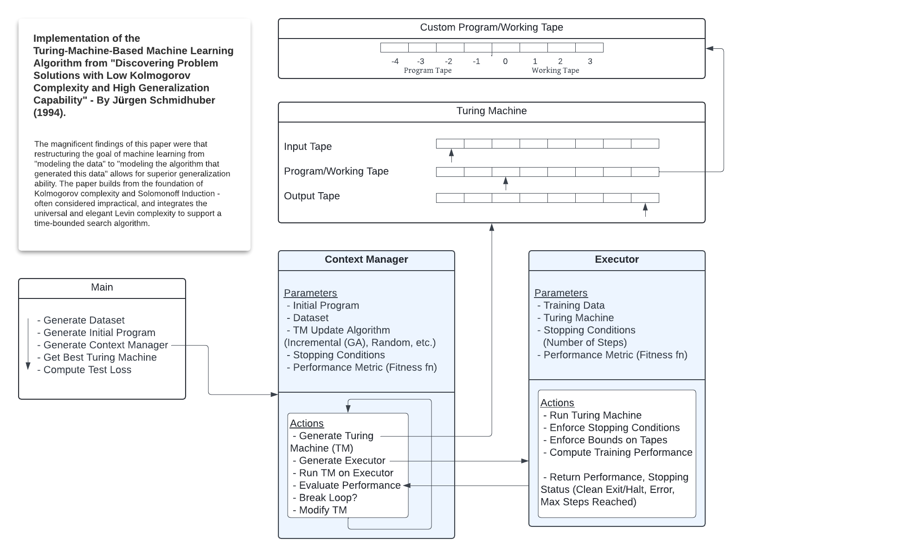

# Overview

An implementation of the Turing-Machine based machine learning algorithm described within "Discovering Problem Solutions with Low Kolmogorov Complexity and High Generalization Capability" by Jürgen Schmidhuber (1994). Within this sub-directory, I have matched some of the results of the paper, and verified the impressive generalization ability.

# Design

