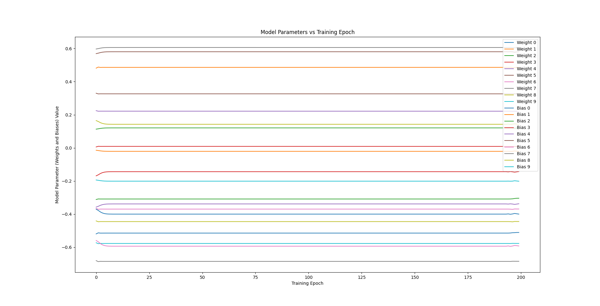
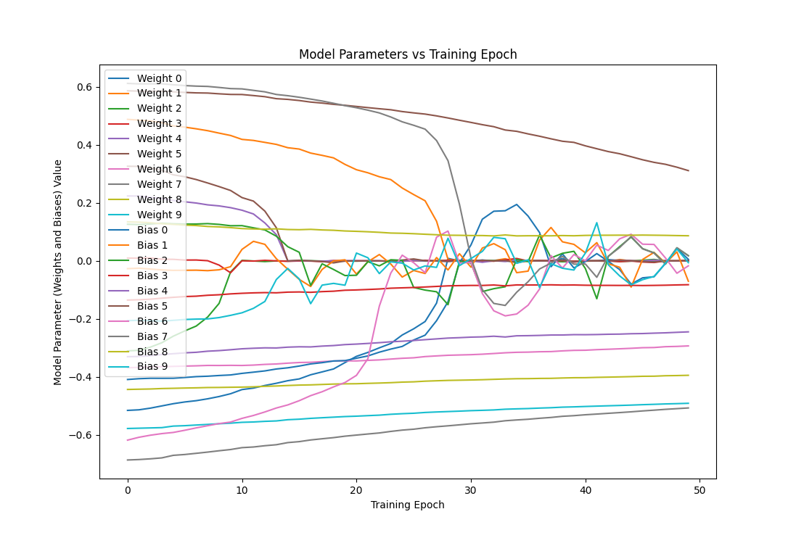

# Theory

Neural networks are known to be universal function approximators. Therefore, neural networks should be able to  approximate addition, subtraction, exponentiation, and any other imaginable function. However, it is known that to approximate the functions to k digits of precision, at least one hidden layer with an arbitrarily large number of nodes (parameterized on k) is necessary. 

However, I theorize (with high confidence) that the minimal neural network required to capture the addition operator is a network with two inputs, one output, no activation functions, and no biases necessary, as shown below.

## Network Structure:

Inputs: x, y
Output node: o

  (x)   (y)
 w1 \   / w2
     (0)

## Optimal Solution
Function to approximate: f(x,y) = x+y
Optimal output = x + y
True neural network function: f(x,y) = w1 * x + w2 * y
Optimal weights are therefore
w1 | w2
-------
1  | 1 
The learned function becomes f(x,y) = 1*x + 1 * y = x + y

Note: If a bias is present, the optimal value is 0, as the true neural network function becomes f(x,y) = w1 * x + w2 * y + b.

## Results and Conclusions

Both a minimal neural network, as described within the "Network Structure" section above, as well as a non-minimal network, with layer sizes: 2 (input) -> 100 (hidden) -> 1 (output) were trained.

The minimal network converges to the optimal solution. It converges best with randomization of training data, but converges regardless of this property, as well as with or without batch training.

The non-minimal network also converges. As a larger network, batching helped more, and weights and biases became uninterpretable. Furthermore, it takes significantly longer to converge.
 - One interesting note is that with the larger structure, a non-trivial solution was converged to. Likely due to randomness of the instantiated weights and biases, the "addition" is distributed across nodes, and weights and biases converge to seemingly random values between [-1,1].
 - 

Not only are large neural networks sample inefficient, but choosing the network size for a problem with a nontrivial and unknown solution is a challenge and obstructs interpretability.

One other notable finding:

 - L2 (Ridge-Regression) Regularization increases the efficiency of learning the correct weights and biases in the minimal network. In the exceedingly large network, it pulled all the weights to lower values, presumably to share the computation between all of them. It would be interesting to inverse the regularization loss term and see if it then became like the minimal example with extra zero weighted and biased nodes.

 - 