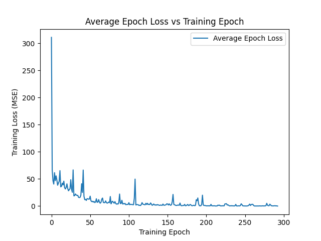
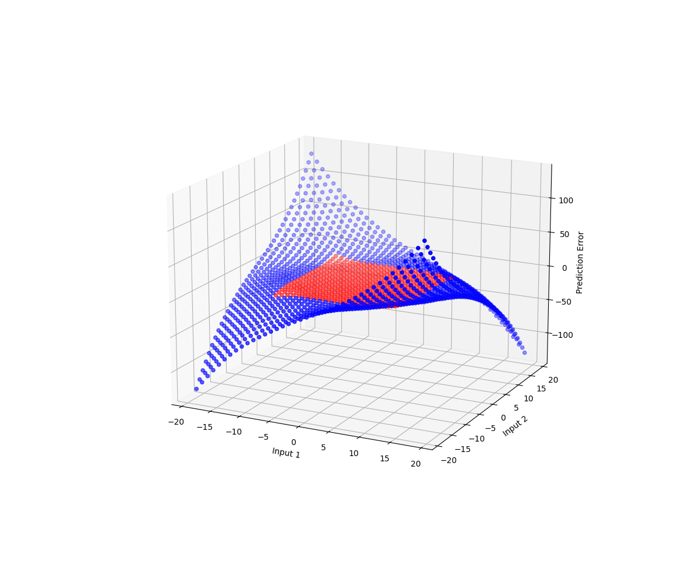

# Theory

I want to determine the generalization ability for a simple single-hidden layer network for a multiplication dataset.

Questions:
 - How does the generalization ability scale with number of hidden nodes?
 - What are the variables I care about?
 - - Inputs i1, i2, true multiplied value, predicted multiplied value, number of hidden layer nodes
 - How do I make "generalization-performance" a metric?
 - - How many numbers past N does the network still predict correctly under some threshold x
 - How long should I train each network?
 - - Until training loss is < threshold y

I will visualize this with:
 - A 3d plot of input (i0, as x) vs. input (i1, as y) vs. prediction_error (as z, colored blue and red) 
 - Generate new graphs for different hidden-layer-sizes

# Methodology

The network is shaped:

Model structure: SingleLayerNNWithActivation(
  (stack): Sequential(
    (0): Linear(in_features=2, out_features=n, bias=True)
    (1): ReLU()
    (2): Linear(in_features=n, out_features=1, bias=True)
  )
)

Where I will/have test(ed) n = \[1,2,5,10,100,1000,10000,100000\]
The training data is every combination of:
 - input 1 = range(10)
 - input 2 = range(10)

The testing data is every combination of:
 - input 1 = range(20)
 - input 2 = range(20)

I will compute a training vs loss curve, as well as the 3d scatter plot defined above.

# Results

Only one training epoch (x) vs loss (y) plot will be shown, and only one input-1 vs input-2 vs test-prediction-error plot will be shown, due to the similarities in plots of all tested parameters.

#### The following plots are trained for ~300 epochs until the training loss is below 0.1. The network has a hidden layer size of 10,000, and uses the ReLU activation after that layer, which seems to provide better performance than sigmoid.

# Conclusions

The trends observed over all different number of hidden layer sizes are the same. The network fails to generalize at all past the exact training data set edges. There is no value of simplicity, pruning, etc. Increasing number of nodes lowered the error in the predictions, and made it take longer to converge to the best-case performance given that network. However, the trend in the final prediction state is the same over all number of hidden layers.