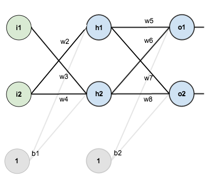

# Overview

This is the test directory, where exploration occurs before experiments are embarked upon.

## A couple such questions we are searching to answer

A simple example to illustrate:

How should you represent this network within a computational graph? Are there benefits to using PyTorch over Tensorflow/Keras, or vice versa? Depending on the scope of the use cases (such as a genetic algorithm on network hierarchy), is it worth modeling each node, weight, and bias as an individual object with requires_grad? If the links removed to turn a fully connected neural network into this network are deleted in entirety, will GPU optimized code lose efficiency?

## Sources:
- Figure 1. from https://stackoverflow.com/questions/53851652/not-fully-connected-layer-in-tensorflow, user Ev4.